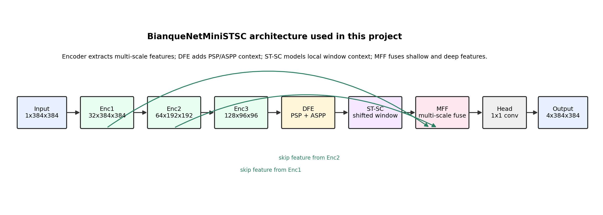
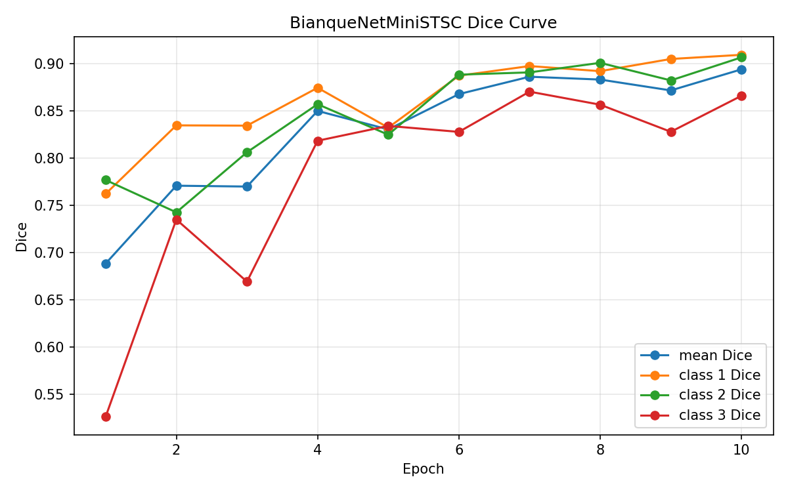
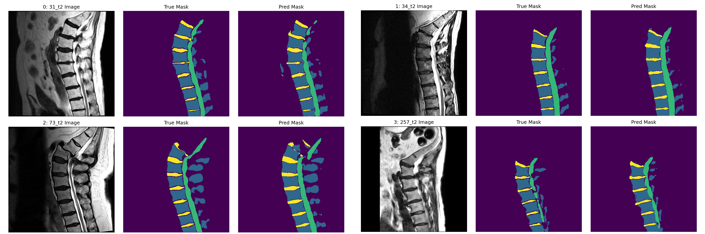

# BianqueNet: Educational Lumbar MRI Segmentation

An educational PyTorch project for four-class segmentation of lumbar spine
structures in sagittal T2-weighted MRI. The repository follows a complete,
reproducible learning path: raw medical-image preparation, a U-Net baseline,
lightweight BianqueNet-inspired modules, validation, and qualitative analysis.

> **Important:** This is an educational lightweight reproduction inspired by
> BianqueNet. It is not the authors' official implementation, is not a
> line-by-line reproduction of the paper, and is not intended for clinical use.

## Project overview

The project segments each 2D MRI slice into four classes:

| Label | Structure |
| ---: | --- |
| 0 | Background |
| 1 | Vertebral body |
| 2 | Spinal canal / CSF |
| 3 | Intervertebral disc |

I implemented the full experimental pipeline in PyTorch, including:

- reading SPIDER `.mha` images and masks with SimpleITK;
- extracting the middle sagittal T2 slice, remapping labels, and resizing to
  `384 x 384`;
- building and checking a standard 2D U-Net baseline;
- implementing lightweight DFE, MFF, and ST-SC modules;
- training with weighted cross-entropy plus Dice loss;
- reporting foreground-class Dice scores and saving prediction examples.

## Model progression

The implementation was developed incrementally so that each component could be
checked before it was added to the full model.

| Stage | Model | Main idea |
| --- | --- | --- |
| 1 | `UNet` | Standard encoder-decoder baseline with skip connections |
| 2 | `BianqueNetMini` | Lightweight encoder followed by DFE |
| 3 | `BianqueNetMiniMFF` | DFE plus multi-scale feature fusion |
| 4 | `BianqueNetMiniSTSC` | DFE, simplified shifted-window context, and MFF |

- **DFE** combines pyramid pooling (PSP) and atrous spatial pyramid pooling
  (ASPP) to collect context at several scales.
- **MFF** fuses shallow spatial detail with middle- and deep-level features.
- **ST-SC** is a simplified shifted-window attention block used to add local
  transformer-style context.



The model classes are defined in [`models/bianquenet.py`](models/bianquenet.py).
Small forward, loss, and train-step checks are kept in `bianquenet/` to document
how the model was built and verified.

## Single-split validation results

The current experiment uses 210 processed 2D T2 samples and one deterministic
80/20 random split (`168` training and `42` validation samples, seed `42`). All
Dice values below exclude the background class.

| Model / checkpoint | Val loss | Mean Dice | Vertebral body | Spinal canal / CSF | Disc |
| --- | ---: | ---: | ---: | ---: | ---: |
| U-Net | 0.5102 | 0.7180 | 0.7268 | 0.7831 | 0.6441 |
| BianqueNetMini | 0.2285 | 0.8914 | 0.8967 | 0.9186 | 0.8590 |
| BianqueNetMiniMFF (best) | 0.2532 | 0.8893 | 0.8864 | 0.9006 | 0.8807 |
| BianqueNetMiniSTSC (best) | 0.2287 | **0.8940** | 0.9094 | 0.9067 | 0.8660 |

These are **validation results from a single split**, not results on the SPIDER
hidden test set. They should not be interpreted as state of the art or compared
directly with the paper's reported test results.



### Qualitative example

The following example shows the processed MRI slice, remapped reference mask,
and `BianqueNetMiniSTSC` prediction from the local validation split.



## Installation

Python 3.9 was used for the recorded experiment. From the repository root:

```powershell
conda create -n bianquenet python=3.9 -y
conda activate bianquenet
python -m pip install -r requirements.txt
```

The model runs on CPU; a CUDA-enabled PyTorch installation is recommended for
training. If needed, install the correct PyTorch build for your platform from
the [official PyTorch installation guide](https://pytorch.org/get-started/locally/).

## Data preparation

The data are not included in this repository. Download the SPIDER dataset from
[Zenodo](https://doi.org/10.5281/zenodo.10159290), then arrange the extracted
files as follows:

```text
data/
└── raw/
    ├── images/                    # MRI .mha files
    ├── masks/                     # reference-mask .mha files
    ├── overview.csv
    └── radiological_gradings.csv
```

Run the preparation and validation scripts from the repository root:

```powershell
python scripts/prepare/prepare_2d_data.py
python scripts/prepare/resize_processed_data.py
python scripts/checks/check_resized_dataset.py
```

`prepare_2d_data.py` keeps standard T2 series, extracts one middle sagittal
slice per series, and maps the original instance labels to the four semantic
classes shown above. Image resizing uses linear interpolation; mask resizing
uses nearest-neighbor interpolation.

## Running the model

First run a data-free shape check:

```powershell
python bianquenet/check_bianquenet_stsc_forward.py
```

After preparing the data, train and evaluate the final educational model:

```powershell
python bianquenet/train_bianquenet_stsc_minimal.py
python bianquenet/evaluate_bianquenet_stsc.py
python bianquenet/save_bianquenet_stsc_predictions.py
```

Model checkpoints and local generated outputs are intentionally excluded from
Git. Training creates the checkpoint required by the evaluation and prediction
scripts.

## Repository structure

```text
models/             Model definitions for U-Net and BianqueNetMini variants
scripts/prepare/    Raw-data conversion and resize scripts
scripts/checks/     Data-integrity and tensor-contract checks
unet/               U-Net baseline experiments
bianquenet/         Incremental module checks, training, evaluation, and figures
utils/              Shared paths and PyTorch Dataset implementation
```

## Limitations

- The experiment uses one 2D middle slice from each of 210 T2 series rather
  than the complete 3D volumes.
- Results come from one random 80/20 split and have not been confirmed with
  repeated seeds, cross-validation, or the hidden SPIDER test set.
- The recorded models were trained for only 10 epochs without a systematic
  hyperparameter search.
- The ST-SC module is deliberately simplified for learning and does not claim
  architectural equivalence to the paper implementation.
- This code and its outputs are for education and research exploration only,
  not diagnosis, treatment planning, or other clinical decision-making.

## References and data attribution

- BianqueNet inspiration: Zheng et al., *Deep learning-based high-accuracy
  quantitation for lumbar intervertebral disc degeneration from MRI*, Nature
  Communications (2022). [DOI](https://doi.org/10.1038/s41467-022-28387-5)
- Dataset: van der Graaf et al., *Lumbar spine segmentation in MR images: a
  dataset and a public benchmark*, Scientific Data (2024).
  [Paper](https://doi.org/10.1038/s41597-024-03090-w) ·
  [Dataset](https://doi.org/10.5281/zenodo.10159290) ·
  [SPIDER challenge](https://spider.grand-challenge.org/)

The SPIDER dataset is available under the
[Creative Commons Attribution 4.0 International license](https://creativecommons.org/licenses/by/4.0/).
The qualitative figure above is derived from SPIDER data; modifications include
middle-slice extraction, semantic label remapping, resizing, and model
prediction by Yuanfeng Liu.

## Code license

The original code in this repository is released under the
[MIT License](LICENSE). Dataset rights remain with the SPIDER dataset authors
under CC BY 4.0.
